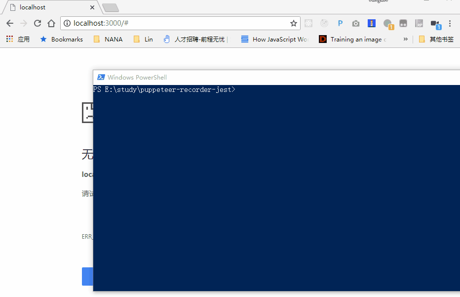
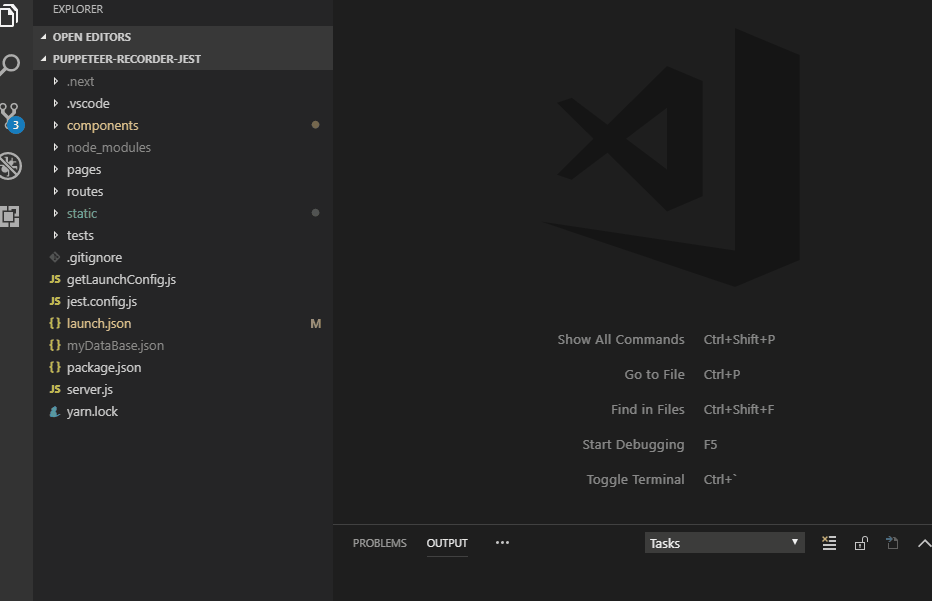
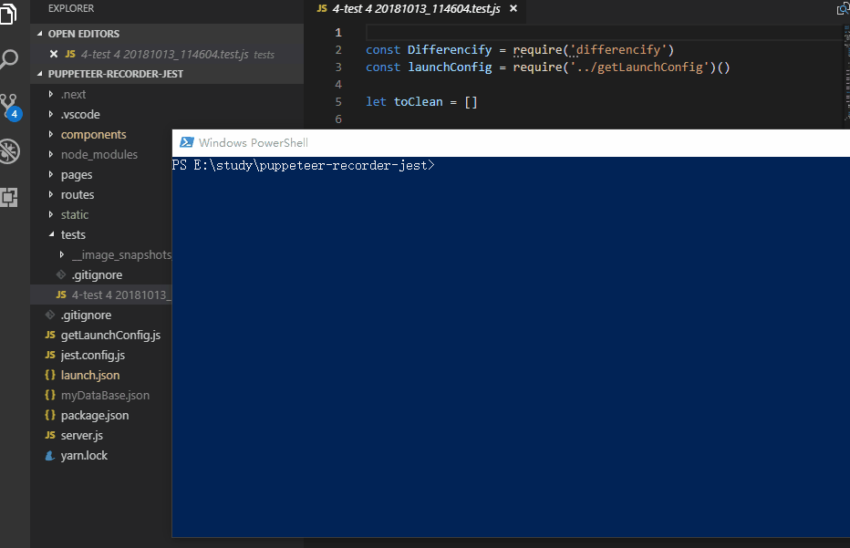
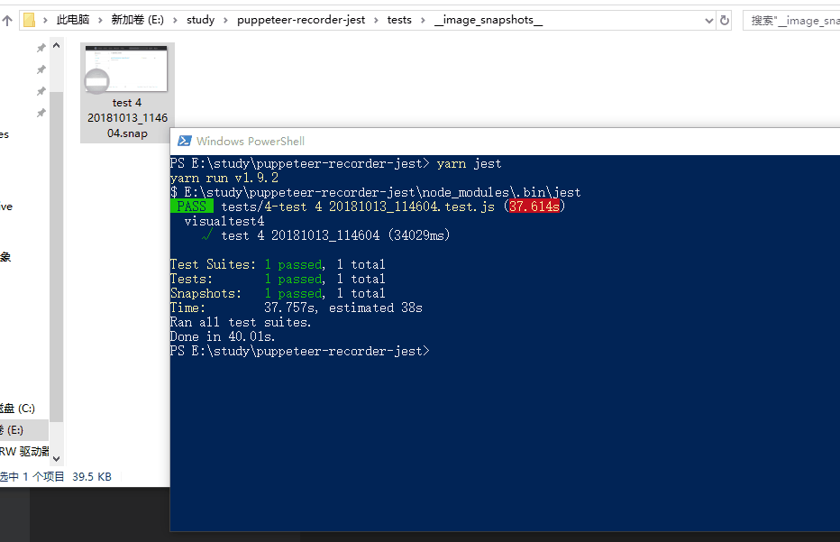
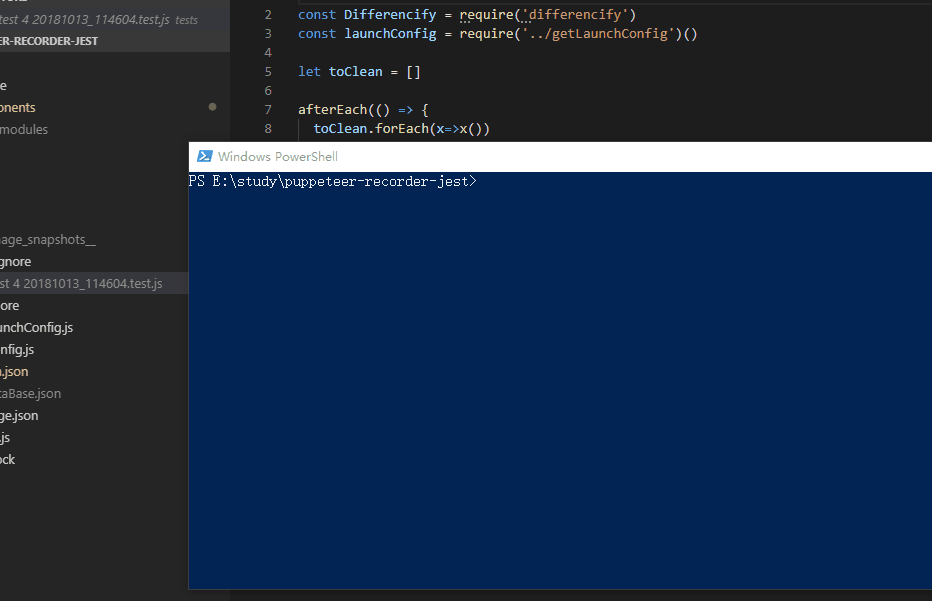
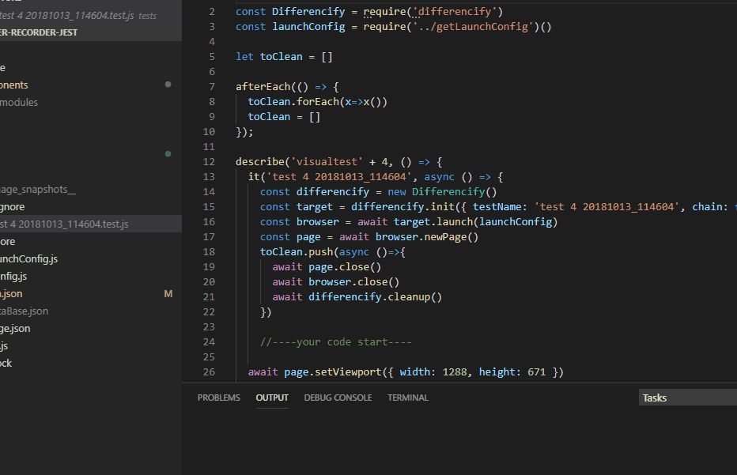
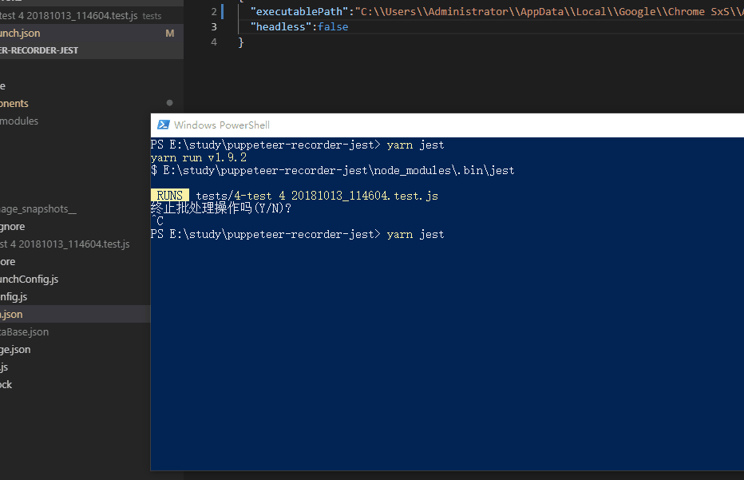

# puppeteer recorder jest

this is a jest code generator | 这是一个jest测试代码生成器

use puppeteer-recorder to make testing development quick and simple | 基于puppeteer-recorder使得测试开发工作简单快捷

## how to use | 如何使用

### generate code | 生成测试代码

start web server|启动服务

```
yarn
yarn dev
```

open browser|打开浏览器 http://localhost:3000

create a test|创建一个测试

paste code from puppeteer-recorder|粘贴puppeteer-recorder代码

then test file should be under `test` folder|`test`目录下应该已经有生成的测试文件了



### generate snap | 生成截图

(optional|可选) config launch params in `launch.json`|在`launch.json`中设置puppeteer启动参数

generate | 生成

```
yarn jest -u
```



### run test | 运行测试

```
yarn jest
```



let's make some difference and test | 我们做点手脚再测一下





### custom logic | 自定义逻辑

modify test file freely | 请自由更改生成的测试文件




